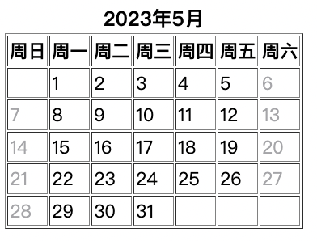
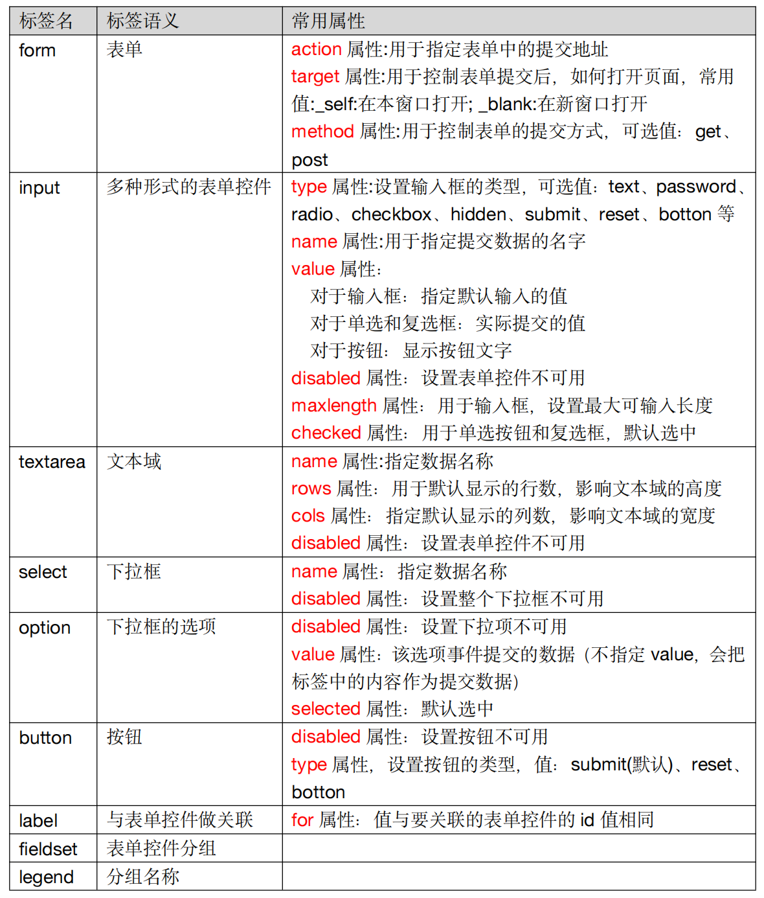

2023-05-10

lijiao 2023-05-10整理

## 学到的快捷键
注释  command /  
在下面新建一行  command enter  
在下面复制一行  option shift 向下箭头  
在上面复制一行  option shifr 向上箭头  
删除某一行  command shift  


## 标签
语义化标签：标签的默认效果不重要，语义重要！  

## 块级元素和行内元素
块级元素：独占一行  
行内元素：不独占一行  

规则1:块级元素中能写行内元素、块级元素  
规则2:行内元素中能写行内元素，但不能写块级元素  

特殊规则1:h1-h6不能互相嵌套. 
特殊规则2:p标签中不能写块级元素  

| 标签     | 语义                             |
| :------- | :------------------------------- |
| ｜em     | 要着重阅读的内容                 |
| ｜strong | 十分重要的内容                   |
| ｜span   | 没有语义，用于包裹短语的通用容器 |

div是大包装袋，span是小包装袋

## 本地路径
./同级  
/下一级  
../上一级  

## 超链接
```html
<a href="www.baidu.com" target="_self">在当前页跳转</a>
<a herf="www.baidu.com" target="_blank">浏览器新开页签跳转</a>
<a herf="文件地址">浏览器可以直接打开的文件，直接打开</a>
<a href="文件地址" download=“文件地址”>浏览器可以直接打开，但强制触发下载</a>
```
```html
<a href="#sss">跳转到超链接sss的锚点</a>
<a href="#">回到顶部</a>
<a href="">刷新当前页面</a>
```
```html
<a href="#abc">看图片</a>
<a name="abc"></a>

```
```html
<a href="tel:10010">给10010打电话</a>
<a href="mailto:10010@qq.com">给10010@qq.com发邮件</a>
<a href="sms:10010">给10010发短信</a>
```

## 列表
有序列表  
```html
<ol>
<li>Coffee</li>
<li>Milk</li>
</ol>
```
无序列表  
```html
<ul>
<li>Coffee</li>
<li>Milk</li>
</ul>
```
自定义列表  
```html
<dl>
<dt>Coffee</dt>
<dd>- black hot drink</dd>
<dt>Milk</dt>
<dd>- white cold drink</dd>
</dl>
```

## 表格
表格:table  
表格标题：caption  
表格头部：th (表头的列)  
表格行：tr  
表格内容里的列：td  
```html
<table border="1px">
    <caption><strong>2023年5月</strong></caption>
        <tr>
            <th>周日</th>
            <th>周一</th>
            <th>周二</th>
            <th>周三</th>
            <th>周四</th>
            <th>周五</th>
            <th>周六</th>
        </tr>
        <tr>
            <td></td>
            <td>1</td>
            <td>2</td>
            <td>3</td>
            <td>4</td>
            <td>5</td>
            <td>6</td>
        </tr>
```


## 表单

<!-- 
| 标签  | 标签语义 | 常用属性                                                                                                                                                                                                                                                                                                                                                      |
|:-----:|--------|-----------------------------------------------------------------------------------------------------------------------------------------------------------------------------------------------------------------------------------------------------------------------------------------------------------------------------------------------------------|
| form  | 表单     | action属性:用于指定表单中的提交地址<br>target属性:用于控制表单提交后，如何打开页面，常用值:_self:在本窗口打开; _blank:在新窗口打开<br>method属性:用于控制表单的提交方式，可选值：get、post                                                                                                                                                                                    |
| input | 多种形式的表单控件   | type属性:设置输入框的类型，可选值：text、password、radio、checkbox、hidden、submit、reset、botton等<br>name属性:用于指定提交数据的名字<br>value属性：<br>对于输入框：指定默认输入的值<br>对于单选和复选框：实际提交的值<br>对于按钮：显示按钮文字<br>disabled属性：设置表单控件不可用<br>maxlength属性：用于输入框，设置最大可输入长度<br>checked属性：用于单选按钮和复选框，默认选中                       |
| textarea |文本域|name属性:指定数据名称<br>rows属性：用于默认显示的行数，影响文本域的高度<br>cols属性：指定默认显示的列数，影响文本域的宽度<br>disabled属性：设置表单控件不可用|
| select|下拉框|name属性：指定数据名称<br>disabled属性：设置整个下拉框不可用|
|option|下拉框的选项|disabled属性：设置下拉项不可用<br>value属性：该选项事件提交的数据（不指定value，会把标签中的内容作为提交数据）<br>selected属性：默认选中|
|botton|按钮|disabled属性：设置按钮不可用<br>type属性，设置按钮的类型，值：submit(默认)、reset、botton|
|label|与表单控件做关联|for属性：值与要关联的表单控件的id值相同|
|fieldset|表单控件分组||
|legend|分组名称|
 -->
## 表单控件
**文本输入框**  
```html
<input type="text">
```
>常用属性如下：  
name属性：数据的名称  
value属性：输入框的默认输入值  
maxlength属性：输入框最大可输入长度  

**密码输入框**  
```html
<input type="password">
```
>常用属性如下：  
name属性：数据的名称  
value属性：输入框的默认输入值（一般不用，无意义）  
maxlength属性：输入框最大可输入长度  

**单选框**
```html
<input type="radio" name="sex" value="female" checked>女
<input type="radio" name="sex" value="male">男
```
>常用属性如下：  
name属性：数据的名称，注意：想要单选效果，多个radio的name属性值要保持一致  
value属性：提交的数据值  
checked属性：让该单选按钮默认选中  

**复选框**
```html
<input type="chekbox" name="hobby" value="smoke" checked>抽烟
<input type="chekbox" name="hobby" value="drink" >喝酒
<input type="chekbox" name="hobby" value="perm" >烫头
```
>常用属性如下：  
name属性：数据的名称  
value属性：提交的数据值  
checked属性：让该复选框默认选中  

**隐藏域**
```html
<input type="hidden" name="tag" value="100">
```
>用户不可见的一个输入区域，作用是：提交表单的时候，携带一些固定的数据  
name属性：数据的名称  
value属性：提交的数据值  

**提交按钮**
```html
<input type="submit" value="点我提交表单">
<button>点我提交表单</button>
```
>注意：  
1.button标签type属性的默认值是submit  
2.button不要指定name属性  
3.input标签编写的按钮，使用value属性指定按钮文字  

**重置按钮**
```html
<input type="reset" value="点我重置">
<button type="reset">点我重置</button>
```
>注意：  
1.button不要指定name属性  
2.input标签编写的按钮，使用value属性指定按钮文字  

**普通按钮**
```html
<input type="button" value="普通按钮">
<button type="button">普通按钮</button>
```
>注意：普通按钮的type值为button，若不写type值是submit会引起表单的提交  

**文本域**
```html
<textarea name="msg" rows="22" cols=“3”>我是文本域</textarea>
```
>常用属性如下：  
1.rows属性：指定默认显示的行数，会影响文本域的高度  
2.cols属性：指定默认显示的列数，会影响文本域的宽度  
3.不能编写type属性  

**下拉框**
```html
<select name="from">
    <option value="黑" selected>黑龙江</option>
    <option value="辽">辽宁</option>
    <option value="吉">吉林</option>
    <option value="粤">广东</option>
</select>
```
>常用属性及注意事项：  
1.name属性：指定数据的名称  
2.option标签设置value属性，如果没有value属性，提交的数据是option中间的文字；如果设置了value属性，提交的数据就是value的值（建议设置value属性）  
3.option标签设置了selected属性，表示默认选中  

## 禁用表单控件
给表单控件的标签设置disabled即可禁用表单控件  
>input、textarea、button、select、option都可以设置disabled属性  

## label标签
label标签可与表单控件相关联，关联之后点击文字，与之对应的表单控件就会获取焦点  
两种与label关联方式如下：  
1.让label标签的for属性的值等于表单控件的id  
2.把表单控件套在label标签的里面  

## fieldset与legend的使用
fieldset可以为表单控件分组、legend标签是分组的标题
```html
<fieldset>
     <legend>主要信息</legend>
    <!-- 文本输入框 -->
    <label for="zhanghu">账户:</label>
    <input type="text" name="account" value="" maxlength="10" id="zhanghu"><br>
    <!-- 密码输入框 -->
    <label>
        密码:
        <input type="password" name="password" value="" maxlength="10"><br>
    </label>
    <!-- 单选框 -->
    性别:
    <input type="radio" name="gender" value="male" id="male">
    <label for="male">男</label>
    <input type="radio" name="gender" value="female" id="female" checked>
    <label for="female">女</label><br>
</fieldset>
<fieldset>
    <legend>附加信息</legend>
    <!-- 多选框 -->
    爱好：
    <label>
        <input type="checkbox" name="hobby" value="smoke" checked>抽烟
    </label>
    <label>
        <input type="checkbox" name="hobby" value="drink">喝酒
    </label>
    <label>
        <input type="checkbox" name="hobby" value="perm" checked>烫头<br>
    </label>
    <label>
        其它：
        <textarea name="other" id="" cols="30" rows="10"></textarea><br>
    </label>
    籍贯：
    <select name="place" id="">
        <option value="1">广东省</option>
        <option value="2" selected>陕西省</option>
        <option value="3">辽宁省</option>
        <option value="4">山东省</option>
        <option value="5">山西省</option>
    </select><br><br> 
</fieldset>
```

