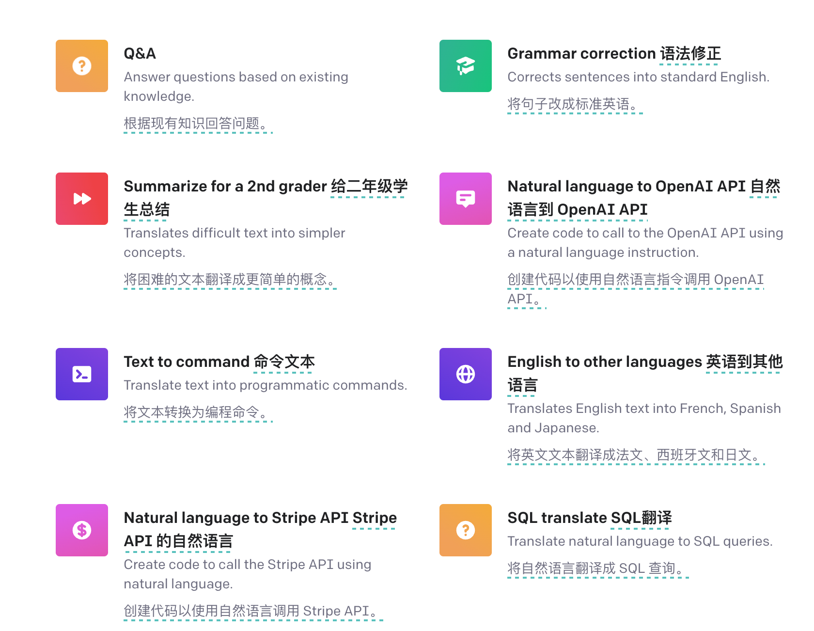
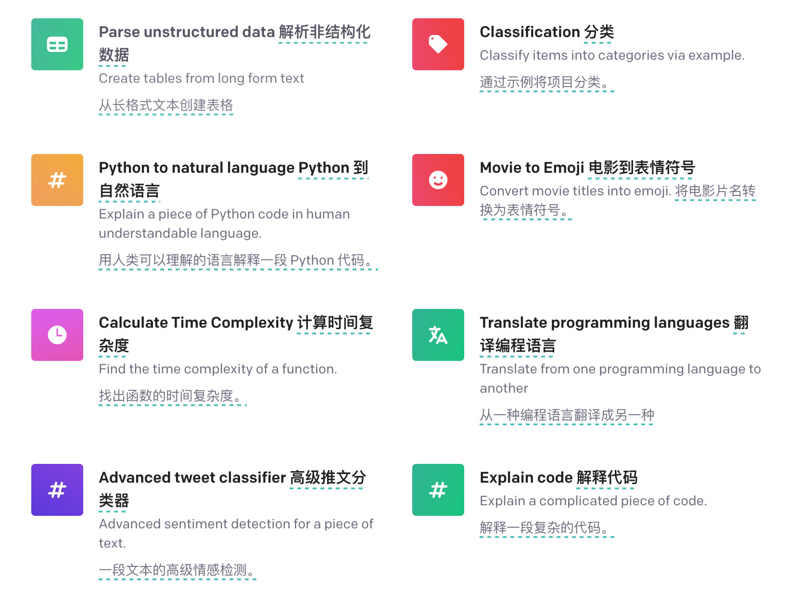
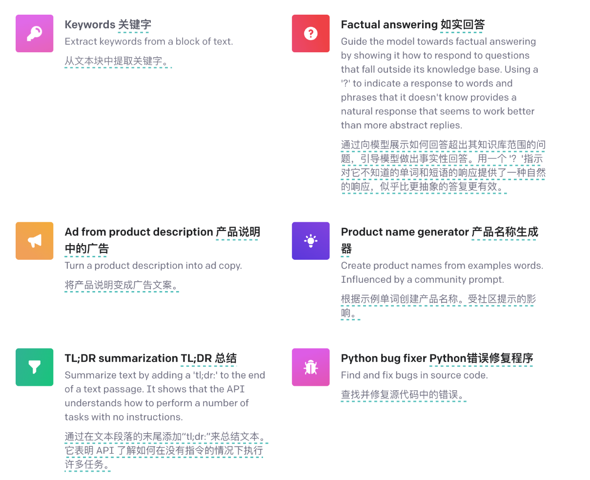
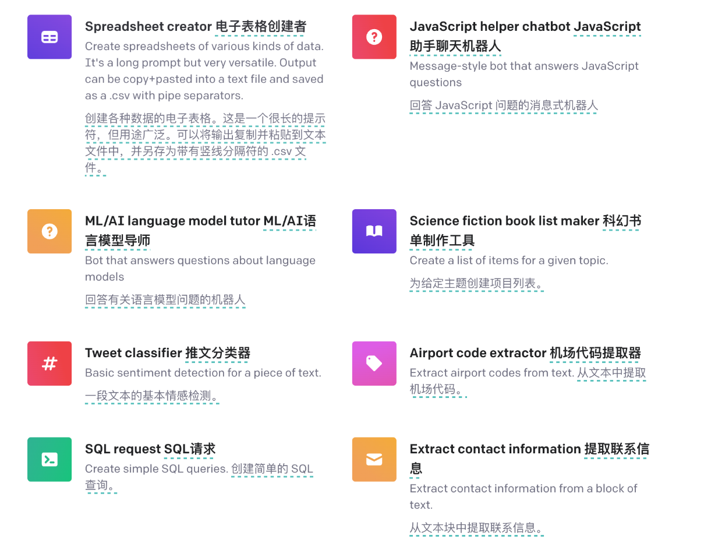
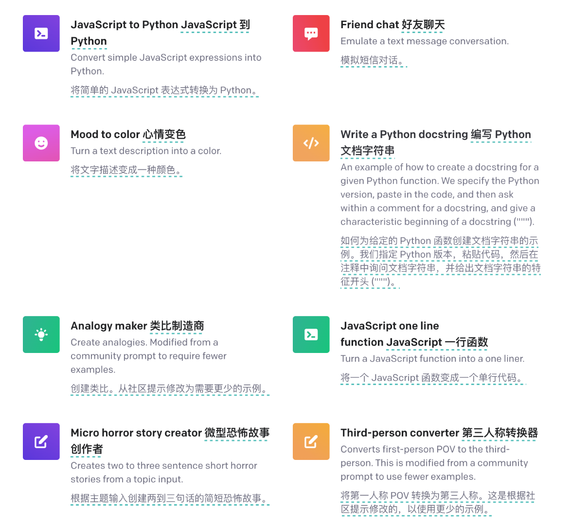
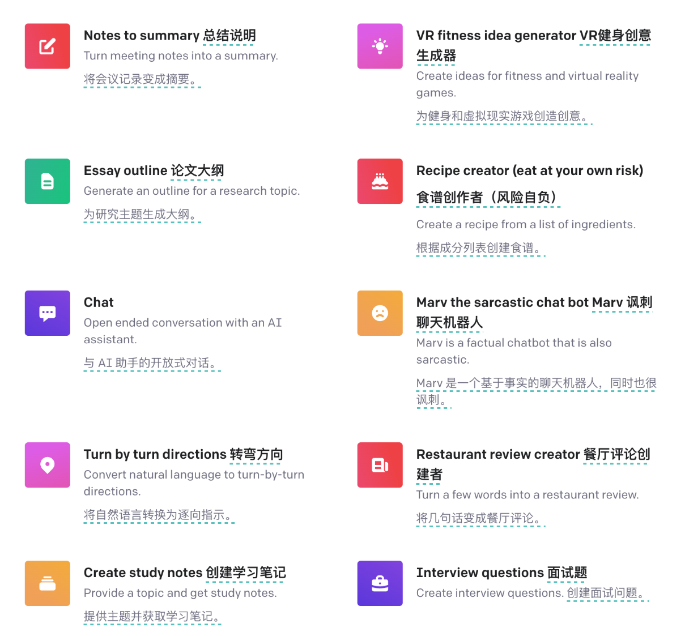

#chatgpt #AI

官方列举的场景
  
  
  
  
  
  

链接：https://platform.openai.com/examples （在不断更新）
应用层次
这里只说基于 chatgpt 的应用，基本是三个层次
1，基于 OpenAi 的  gpt-turbo-3.5 api 或 chatgpt 网站包装的聊天网站
2，基于 OpenAi 的  gpt-turbo-3.5 api 的提示词做包装，提供各种细分场景的应用或服务
3，基于 OpenAi 的 gpt-turbo-3.5 api 数据训练后的垂直应用，或根据 gpt-3 的微调后的模型的垂直领域的 AI 应用

案例
1，基于 OpenAi 的 gpt-turbo-3.5 api 或 chatgpt 网站包装的聊天网站  

免费使用,有的需要科学上网  
https://freegpt.one/  
https://desk.im  
https://ai.ls/  
https://ai.ci/  
https://94gpt.com/  
https://fastgpt.app/  
https://chat.zecoba.cn/  
https://chatforai.com/  
https://playai.today/  

之前记录的,未验证还能否继续使用  
https://chatgpt.ddiu.io/  
https://freechatgpt.lol/  
https://freegpt.one/  
https://chatgpt.ddiu.me/  
https://chat.binjie.site:7777/#/chat  
https://freechatgpt.chat/  
https://chat.theb.ai/  
https://chatgpt.ppt6666.com/  
https://aichat.baodai.pro/  
https://chat.zecoba.cn/  

合集  
https://chatgpts.ninvfeng.xyz/  

2，基于 OpenAi 的 gpt-turbo-3.5 api  的提示词（prompt）做包装，提供各种细分场景的应用或服务

**AI助手类**  
https://open-gpt.app/  
1700多个应用，还在不断增长，开放的力量还是厉害啊  

https://ai-toolbox.codefuture.top/  
如下细分场景：周报生成器,邮件小助手,阅读小助手,英文写作小助手,SWOT分析法,OKR生成器,塔罗牌预测小助手,餐厅点评小助手,商品点评小助手,小红书风格模拟器,解梦小助手,节日祝福,职场开解小树洞,知识小百科,夸夸小助手,知乎风格问答器,emoji翻译小助手,甩锅小助手,哄女友小助手,高情商回复小助手  

https://chatexcel.com/convert  
主打用对话的形式实现Excel复杂操作（Chat-to-Excel），告别记函数、手动设置公式。  

**翻译类**   
翻译软件  
https://github.com/yetone/openai-translator  
翻译书籍  
https://github.com/yihong0618/bilingual_book_maker  
在线翻译  
https://gpt.ericfu.me/  
i18n 翻译工具  
https://github.com/pandodao/i18n-cli  
文档翻译，返回中英文对照结果  
https://fsys.app/  
弹幕，字幕翻译  
https://github.com/cgsvv/AISubtitle  

**聊天类**  
心灵伴侣,在线解忧  
https://icanfeelyou.ink/  
将siri改造成chatgpt返回结果  
https://github.com/Yue-Yang/ChatGPT-Siri/blob/main/README-zh_CN.md  
https://www.appinn.com/tag/%E5%BF%AB%E6%8D%B7%E6%8C%87%E4%BB%A4/  
聊天总结   可以结合CRM领域  
https://openai.com/waitlist/slack  

**视频总结，内容总结**  
总结b站视频

- [https://chrome.google.com/webstore/detail/summary-for-bilibili/hjjdhgophcjfgkempifgiflgekhecnme/related?hl=zh-CN](https://chrome.google.com/webstore/detail/summary-for-bilibili/hjjdhgophcjfgkempifgiflgekhecnme/related?hl=zh-CN)
- [https://b.jimmylv.cn/](https://b.jimmylv.cn/)

总结YouTube视频

- [https://glasp.co/youtube-summary](https://glasp.co/youtube-summary)
- [http://glarity.app](http://glarity.app)

自动提炼 TechCrunch 文章并生成总结

- [http://techcrunchsummary.com/](http://techcrunchsummary.com/)

Feather AI 视频音频总结

- [https://featherai.co/](https://featherai.co/)

**内容生成**  
[Google Slides 自动直接生成整个演示文档](https://www.gptforslides.app/)    
[生成ppt](https://mp.weixin.qq.com/s/6ZE59h9fP_4UtS4hwDVXeg)
  

3，基于 OpenAi 的 gpt-turbo-3.5 api  数据训练后的垂直应用，或根据 gpt-3 的微调后的模型的垂直领域的 AI 应用

gpt-3 支持Fine-tuning API （微调）  
gpt-turbo-3.5 api 没有Fine-tuning API，所以需要想别的办法：  
主要有两个技术，这两个是可以结合使用的  

1，Langchain  
LANGCHAIN是一种用于构建基于大规模语言模型（LLM）的应用的库，可以将不同的组件链接起来，例如内存、数据源或生成器 。LLM是一种能够处理自然语言或编程语言的深度学习模型，例如GPT-3或Codex 。LANGCHAIN允许用户使用LLM来实现各种功能，例如问答、摘要、翻译、对话等 。

[仓库](https://github.com/hwchase17/langchain)  
[使用 langchain 的 LLM 会话记忆](https://www.pinecone.io/learn/langchain-conversational-memory/)  
[如何使用LangChain为您的知识库构建Notion聊天机器人](https://www.youtube.com/watch?v=prbloUGlvLE)  
[部署 GPT-3 API 和 LangChain 应用程序的 7 种方法](https://ramsrigoutham.medium.com/7-ways-to-deploy-gpt-3-apis-and-langchain-apps-baf225950834)

2，GPT-Index

GPT-IDEX（也称为LlamaIndex）是一个项目，提供了一个中心接口，将LLM与外部数据连接起来。它可以让用户使用LLM来查询和更新数据库、搜索引擎或其他数据源。它还可以让用户使用LLM来生成新的数据或内容

[介绍](https://twitter-thread.com/t/1631779232455053313),
[仓库](https://github.com/jerryjliu/gpt_index),
[文档](https://gpt-index.readthedocs.io/en/latest/index.html)  
[openai官方教程及案例](https://github.com/openai/openai-cookbook)

应用：

[上传pdf,回答pdf相关的问题](https://www.chatpdf.com/)  
[Fini-将知识库转换为聊天机器人](https://www.usefini.com/)  
[通过 Colab 使用 ChatGPT API 创建您自己的ChatGPT 聊天机器人](https://colab.research.google.com/github/minimaxir/chatgpt_api_test/blob/main/glados_chatbot.ipynb)

