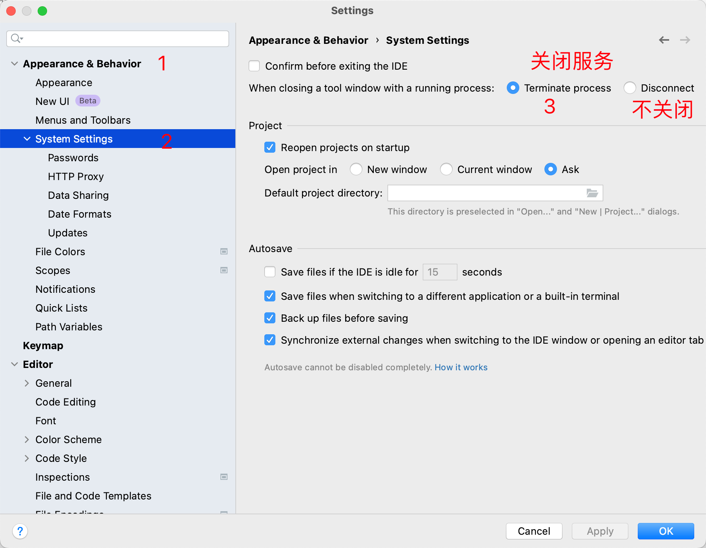

2023-03-28

如题, 有时候我们在 IDEA 中运行了一个服务, 但是关闭IDEA后, 服务还在运行, 这时候我们就需要手动关闭服务(命令行或任务管理器杀掉服务), 这样很麻烦, 有没有办法让IDEA关闭后自动关闭运行的服务呢?

## 解决方案

在 IDEA 中, 打开`Settings` -> `System setiings`  中勾选 -> `Terminate process` 即可.

  

