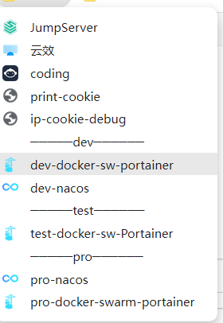

#技巧 #工具 



上图中的分割符，可以使书签更加的清晰，下面这个链接可以制作出上面的效果
https://separator.mayastudios.com/index.php?t=horz

原理就是 一个 a 标签 name是分隔符，你也可以修改成有意义的，比如上图的 dev、test 等等  

图标是一个空白的图片，知道这个原理之后，你可以自己制作一个自己的分隔符标签工具

a标签
```
<a class="me" href="" title="Drag me!">───────────</a>

```


空白角标
```
<svg version="1.1" xmlns="http://www.w3.org/2000/svg" viewBox="0 0 16 16">

</svg>

```


**注意**：开启了拖拽插件，通过拖拽添加标签可能不成功，需要禁用拖拽标签或者手动添加标签才能成功